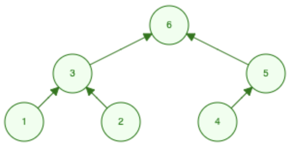
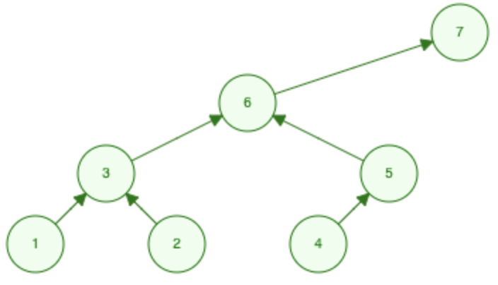
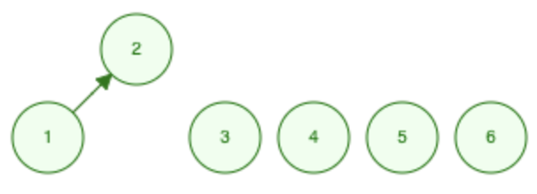
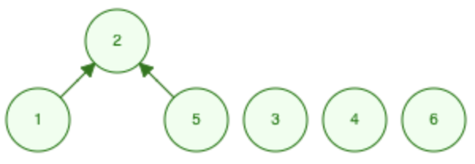
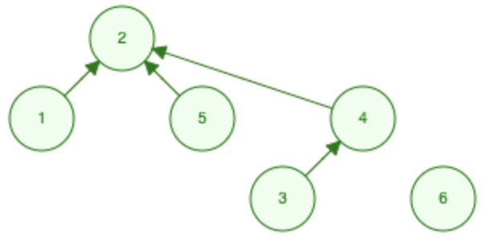
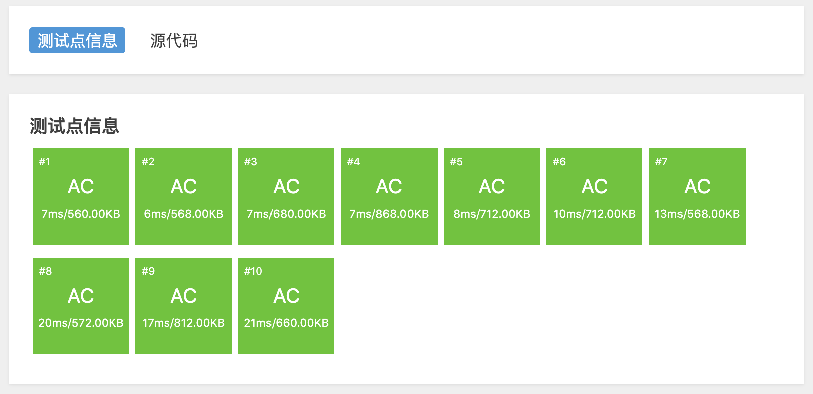

# 按秩合并模板

由于路径压缩只压缩 `x` 到其根节点的路径，而 `x` 子节点的路径不会被优化。如果每次只操作根节点，还是可能得到一颗复杂的树。比如依次执行如下操作：

1. `Union(1, 3)`
2. `Union(2, 3)`
3. `Union(4, 5)`
4. `Union(3, 6)`
5. `Union(5, 6)`

得到如下结构：



如果再执行 `Union(6, 7)`，其中 `7` 是一个单独的节点。按照前面两个模板的逻辑，会将 `6` 指向 `7`，导致 `6` 的子节点的深度都会加 `1`：



导致 `6` 的子节点到根节点的距离变长，之后寻找根节点的路径也就相应变长。虽然会有路径压缩进行优化，但是路径压缩也是需要先走完整条路径，才能进行优化。更优的方式是将 `7` 指向 `6`。

所以本模板里面加入**按秩合并**进行优化。**秩**是衡量一颗树的指标，它可以是：

- 树中节点数

- 树中节点的最大深度

下面例子中的秩为树中节点数。

## 例题

[「洛谷」P 1551 亲戚](https://www.luogu.com.cn/problem/P1551)。

## 分析

### 初始状态


给定 6 个人，一开始并不知道他们之间的关系，所以每个人都是一个单独的集合，每个集合的代表就是它自己。

### 合并

`1` 和 `2` 是亲戚关系，将他们合并为一个集合。他们初始时 `rank` 信息是一样的，合并之后，用 `2` 代表整个集合，同时更新 `2` 的 `rank` 信息 `rank[2] = 2`：



`1` 和 `5` 是亲戚关系，根据题意合并两人所在的集合。`1` 所在集合的代表是 `2`，它的 `rank` 信息是 `2`。而 `5` 的 `rank` 信息是 `1`，所以将 `5` 合并到 `1` 所在集合：



依次执行`Union(3, 4)`，`Union(5, 2)`，`Union(1, 3)` 进行合并之后得到如下结构：



## 代码

为了实现按秩合并，我们使用 `rank` 数组记录额外信息，在本例当中就是**树中节点数**。在调用 `Union(x, y)` 函数时通过比较不同集合的信息进行合并，而不是盲目的将 `x` 合并到 `y`。

```cpp
#include <iostream>
#include <vector>

using namespace std;

class UnionFind {
   public:
    vector<int> parent;
    vector<int> rank;
    UnionFind(int n) {
        // 集合的代表元素 parent 数组
        parent = vector<int>(n, 0);
        // 集合的节点个数 rank 数组
        rank = vector<int>(n, 1);
        // 初始时每个集合的代表元素就是自身
        // 初始时每个集合只有一个元素
        for (int i = 0; i < n; ++i) {
            parent[i] = i;
            rank[i] = 1;
        }
    }

    int Find(int x) {
        /* 查找 x 所在集合的代表元素，即父节点 */
        if (x != parent[x]) {
            // 非集合代表元素，在递归调用返回的时候，将沿途经过的结点指向根节点
            parent[x] = Find(parent[x]);
        }
        return parent[x];
    }

    void Union(int x, int y) {
        /* 合并 x y 所在集合 */
        // 先查找 x y 所在集合的代表元素
        int px = Find(x), py = Find(y);
        if (px != py) {
            // 不在同一个集合，将 x 所在集合合并到 y 所在集合
            if (rank[px] > rank[py]) {
                // x 所在集合比 y 所在集合节点数多
                // 将 y 所在集合合并到 x 所在集合，并更新 x 所在集合的节点数信息
                parent[py] = px;
                rank[px] += rank[py];
            } else {
                // y 所在集合节点数不小于 x 所在集合节点数
                // 将 x 所在集合合并到 y 所在集合，并更新 y 所在集合的节点数信息
                parent[px] = py;
                rank[py] += rank[px];
            }
        }
    }
};

int main() {
    // freopen("1.txt", "r", stdin);
    int n, m, p;
    cin >> n >> m >> p;

    UnionFind *uf = new UnionFind(n + 1);

    int mi, mj;
    for (int i = 0; i < m; ++i) {
        cin >> mi >> mj;
        uf->Union(mi, mj);
    }

    int pi, pj;
    for (int i = 0; i < p; ++i) {
        cin >> pi >> pj;
        int ppi = uf->Find(pi), ppj = uf->Find(pj);
        if (ppi == ppj) {
            cout << "Yes" << endl;
        } else {
            cout << "No" << endl;
        }
    }
}
```

评测结果：



## 注意

**按秩合并**中只有根节点的秩信息是有效的，子节点信息是无效的。

## 时间复杂度

理论上，「路径压缩」与「按秩合并」，执行 $m$ 次 `Find` 操作，$n-1$ 次 `Union` 操作的时间复杂度是 **$O(m \space \alpha (m, n))$**，其中 $m \geq n $，$\alpha(m,n)$ 是反阿克曼函数。

反阿克曼函数是一个渐进复杂度很低的函数，通常可以认为是**常数级别的时间复杂度**。感兴趣的读者可以查阅引用。

**Theorem.** *[Tarjan 1975]* Link-by-size with path compression performs any intermixed sequence of $m \geq n$ FIND and $n-1$ UNION operations in $O(m \space \alpha(m, n))$ time, where $\alpha(m, n)$ is a functional inverse of the Ackermann function. [1, 2]

## 引用

[1]：[Efficiency of a Good But Not Linear Set Union Algorithm]([http://www.e-maxx.ru/bookz/files/dsu/Efficiency%20of%20a%20Good%20But%20Not%20Linear%20Set%20Union%20Algorithm.%20Tarjan.pdf](http://www.e-maxx.ru/bookz/files/dsu/Efficiency of a Good But Not Linear Set Union Algorithm. Tarjan.pdf))

[2]：[UnionFind](https://www.cs.princeton.edu/courses/archive/spring13/cos423/lectures/UnionFind.pdf)

