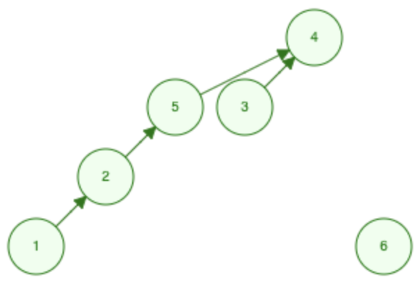

# 基础模板

## 例题

[「洛谷」P 1551 亲戚](https://www.luogu.com.cn/problem/P1551)

> #### 题目背景
>
> 若某个家族人员过于庞大，要判断两个是否是亲戚，确实还很不容易，现在给出某个亲戚关系图，求任意给出的两个人是否具有亲戚关系。
>
> #### 题目描述
>
> 规定：`x` 和 `y` 是亲戚，`y` 和 `z` 是亲戚，那么 `x` 和 `z` 也是亲戚。如果 `x`，`y` 是亲戚，那么 `x` 的亲戚都是 `y` 的亲戚，`y` 的亲戚也都是 `x` 的亲戚。
>
> #### 输入格式
>
> 第一行：三个整数 `n`，`m`，`p`，（`n<=5000`，`m<=5000`，`p<=5000`），分别表示有 `n` 个人，`m` 个亲戚关系，询问 `p` 对亲戚关系。
>
> 以下 `m` 行：每行两个数 `Mi`，`Mj`，`1<=Mi`，`Mj<=N`，表示 `Mi` 和 `Mj` 具有亲戚关系。
>
> 接下来 `p` 行：每行两个数 `Pi`，`Pj`，询问 `Pi` 和 `Pj` 是否具有亲戚关系。
>
> #### 输入输出样例
>
> **输入 #1**
>
> ```
> 6 5 3
> 1 2
> 1 5
> 3 4
> 5 2
> 1 3
> 1 4
> 2 3
> 5 6
> ```
>
> **输出 #1**
>
> ```
> Yes
> Yes
> No
> ```

## 思路

这是一道典型的并查集应用的题目。`Mi`，`Mj` 是亲戚关系就代表可以合并 `Mi`，`Mj` 所在的集合。`Pi`，`Pj` 是否具有亲戚关系，只需判断他们是否在同一个集合即可。

**初始状态**


给定 6 个人，一开始我们并不知道他们的亲戚关系，所以每个人都是一个单独的集合，每个集合的代表就是它自己。

**第一对亲戚关系：`1 2`**


第一个人和第二个人是亲戚关系，将他们合并为一个集合。合并之后，用 2 代表整个集合。

**第二对亲戚关系：`1 5`**

第一个人和第五个人是亲戚关系，根据题意合并两人所在的集合。第一个人所在集合的代表是 2，合并之后用 5 代表整个集合。

依次对 `3 4`，`5 2`，`1 3`，进行合并之后得到如下的亲戚关系图：



查询时明显看出 `1 4` 和 `2 3` 属于同一个集合，即有亲戚关系，所以返回 `Yes`。`5 6`不属于同一个集合，所以返回 `No`。


## 引用

1. [可视化网址](https://www.cs.usfca.edu/~galles/JavascriptVisual/DisjointSets.html)